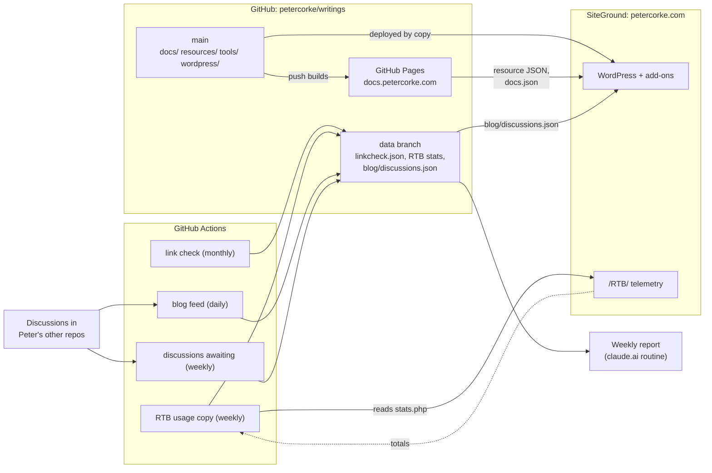

# How the pieces fit together

This repository is the home of two sites and the machinery between them:

- **[docs.petercorke.com](https://docs.petercorke.com)**: the notes and papers, a generated
  static site (GitHub Pages).
- **[petercorke.com](https://petercorke.com)**: a WordPress site on SiteGround, with a few add-ons
  whose master copies live here, in `wordpress/`.

Several small jobs on GitHub feed data to both, and a weekly report reads the results. This page
is the map; each part has its own README for detail.

## What runs where

| Piece | Runs on | Source of truth | Detail |
|---|---|---|---|
| WordPress site (posts, pages, menus) | SiteGround | the WordPress database, not this repo | |
| Add-ons for the site: plugins, a theme template, redirects, the old `/RTB/` area | SiteGround (PHP) | **this repo, `wordpress/`**, deployed by copy | [`wordpress/README.md`](wordpress/README.md) |
| docs.petercorke.com, resource-list JSON, `docs.json` | GitHub Pages | `docs/`, `resources/`, built by `tools/build.py` on every push to `main` | [`README.md`](README.md), [`tools/README.md`](tools/README.md) |
| Scheduled collectors (link check, RTB usage, blog feed, discussions awaiting reply) | GitHub Actions | `tools/`, `.github/workflows/` | below |
| Machine-written data | the **`data` branch** of this repo | written only by the workflows | its own `README.md` |
| Weekly ecosystem report | a scheduled routine on claude.ai | reads the repos and the `data` branch; posts to an issue in `rvc-ecosystem` | |

## The picture

## The flows

Each follows the same pattern: a script produces a small file, the file is published somewhere
public, and a consumer fetches it, caches it, and keeps the last good copy.

**Resource lists on chapter pages.** `resources/*.yml` are the curated links. The Pages build
validates them and publishes a JSON file per topic on docs.petercorke.com. The `[rvc_resources
topic="…"]` shortcode (`wordpress/rvc-resources.php`) shows a topic on each edition's chapter
page, cached for 12 hours. *If docs.petercorke.com is down*, pages show the last good list.

**Link check.** Monthly, `tools/linkcheck.py` tests every link in `resources/`. It writes
`resources/linkcheck.json` to the `data` branch and keeps one `link-check` issue open while any
link needs attention. First-time non-answers are held back and confirmed after a week.

**RTB for MATLAB usage.** Old releases of the Robotics Toolbox for MATLAB ask petercorke.com for
the current version when MATLAB starts. `wordpress/rtb/` counts those checks and the downloads
from the old `/RTB/` page, by country and release, with **no IP addresses kept**. Weekly, a
workflow copies the totals into `stats/rtb/` on the `data` branch ([`wordpress/rtb/README.md`](wordpress/rtb/README.md)).

**Blog page.** `[blog_feed]` (`wordpress/blog-feed.php`) lists the site's posts and the
announcements from Peter's GitHub Discussions in one chronological list, grouped by year. Daily,
`tools/blogfeed.py` collects the discussions in the **Announcements** category (Announcement
format, so only maintainers can post there) of every public repo of his with Discussions on,
into `blog/discussions.json` on the `data` branch. To put something on the Blog, post it in
Announcements; nothing else is promoted. The plugin fetches that, cached for 6 hours.
*If GitHub is down*, the list shows posts and the last known discussions.

**Site search.** `wordpress/docs-search.php` lists matching documents from `docs.json` (written
by the site build) above the normal WordPress results, cached for 12 hours.

**Discussions awaiting a reply.** Weekly, just before the report, `tools/discussions_awaiting.py`
finds open Discussions whose latest activity is from someone other than Peter (bots ignored) and
writes `reports/discussions-awaiting.json` to the `data` branch. Waiting a year or less is
"recent" and listed one by one; older is "backlog" and reported as a count plus the oldest few, so
stale threads can't bury new ones.

**Weekly report.** A scheduled routine checks every repo for items awaiting a reply, reads the
link-check, RTB and discussions files from the `data` branch, and posts the result as a comment on
a tracking issue in `rvc-ecosystem`.

**Other add-ons.** `buy/` (book links that go to the right Amazon store or the publisher, with
clicks counted), `anniversary-tag.php` and `no-event-schema.php` ("This day in robotics"),
`paste-as-text.php` (the editor pastes plain text), `mathjax-uncombined.php`, and the theme
templates `search.php` and `page-post-archive.php`. See [`wordpress/README.md`](wordpress/README.md).

## Rules that keep it manageable

1. **The repo holds the master; the server holds a copy.** Edit in `wordpress/`, deploy by
   copying, and check that the live file's hash matches the committed one.
2. **Bots never write to `main`.** Scheduled jobs commit to the `data` branch, so `main` doesn't
   move under work in progress and a data update doesn't rebuild the site. Readers use
   `ref: data` or `raw.githubusercontent.com/petercorke/writings/data/<path>`.
3. **Consumers cache and degrade.** A plugin that fetches something keeps a time-limited cache
   *and* the last good copy, so an outage elsewhere shows an older list, not an error.
4. **Public repository.** Nothing here may contain credentials, personal data or IP addresses.
   Aggregated counts only.
5. **Change the source, not the symptom.** If a list is wrong, fix the YAML, the script or the
   plugin and redeploy; don't hand-edit the generated output.

## When something looks wrong

| You see | Look at |
|---|---|
| A resource list on a chapter page is missing or old | `https://docs.petercorke.com/resources/<topic>.json`; the last Pages run |
| The Blog page lacks a recent discussion | the `Blog feed` run; `data` branch `blog/discussions.json`; the 6-hour cache |
| The weekly report's RTB, link or discussions section is empty | the `data` branch files and their `generated` / `checked` dates |
| A new category isn't on Articles & tutorials | it needs at least one post; `page-post-archive.php` adds it automatically |
| Pasted text has odd spacing | `paste-as-text.php` should prevent it; see the paste notes in `wordpress/README.md` |
